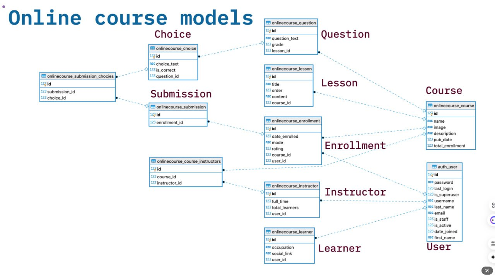
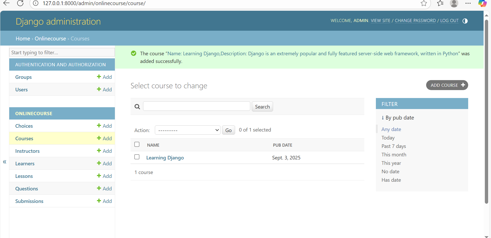
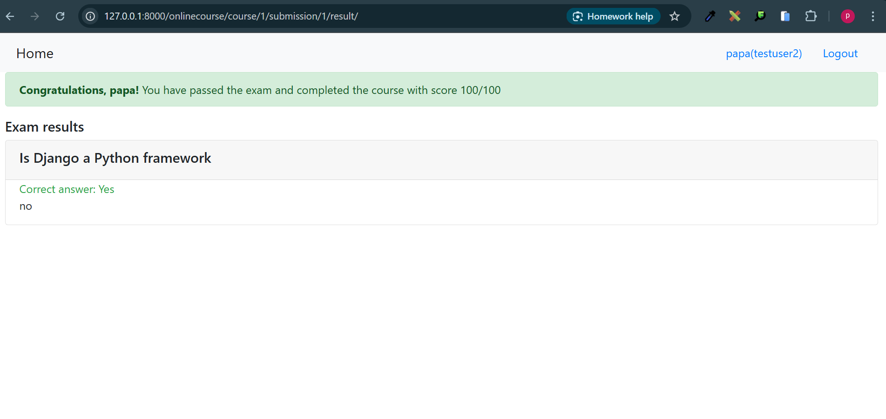

# 📚 Online Course Platform - Documentation Technique et Fonctionnelle

## UML Diagramm


## Other screnshoot



---



## 🎯 Objectif
Cette plateforme d'apprentissage en ligne permet aux utilisateurs de s'inscrire à des cours, de suivre des leçons et de passer des examens avec un système de validation automatisé. Elle gère l'inscription des apprenants, le suivi des cours et l'évaluation des connaissances.

## 🏗️ Principes clés

### Architecture MVC Django
- **Models** : Gestion des données (Course, Learner, Instructor, Enrollment, Question, Choice, Submission)
- **Views** : Logique métier et traitement des requêtes
- **Templates** : Interface utilisateur avec Bootstrap

### Workflow d'apprentissage
- **Inscription** : Création de compte utilisateur
- **Enrollment** : Inscription à un cours spécifique
- **Learning** : Accès aux leçons du cours
- **Examination** : Passage d'examens avec questions à choix multiples
- **Evaluation** : Calcul automatique des scores et validation

### Système de validation
- **Soumission d'examen** : Collecte des réponses utilisateur
- **Évaluation automatique** : Comparaison avec les bonnes réponses
- **Seuil de réussite** : Score minimum de 80/100 pour valider le cours

## 📊 Modèle de données

### Entités principales

#### User (Django Auth)
- Gestion des utilisateurs (apprenants et instructeurs)
- Authentification et autorisation

#### Course
```python
- name: CharField (nom du cours)
- image: ImageField (image du cours)
- description: CharField (description)
- pub_date: DateField (date de publication)
- instructors: ManyToManyField (instructeurs)
- total_enrollment: IntegerField (nombre d'inscrits)
```

#### Instructor
```python
- user: ForeignKey (utilisateur)
- full_time: BooleanField (temps plein)
- total_learners: IntegerField (nombre d'apprenants)
```

#### Learner
```python
- user: ForeignKey (utilisateur)
- occupation: CharField (profession)
- social_link: URLField (lien social)
```

#### Enrollment
```python
- user: ForeignKey (utilisateur)
- course: ForeignKey (cours)
- date_enrolled: DateField (date d'inscription)
- mode: CharField (mode d'inscription)
- rating: FloatField (évaluation)
```

#### Question
```python
- course: ForeignKey (cours)
- question_text: CharField (texte de la question)
- grade: IntegerField (points attribués)
```

#### Choice
```python
- question: ForeignKey (question)
- content: CharField (contenu du choix)
- is_correct: BooleanField (réponse correcte)
```

#### Submission
```python
- enrollment: ForeignKey (inscription)
- choices: ManyToManyField (choix sélectionnés)
```

## 💻 Interfaces utilisateur

### Pages principales

#### Accueil (`/`)
- Liste des cours disponibles
- Tri par nombre d'inscriptions
- Statut d'inscription pour les utilisateurs connectés

#### Détail du cours (`/onlinecourse/<id>/`)
- Informations détaillées du cours
- Leçons disponibles
- Bouton d'inscription
- Accès à l'examen (si inscrit)

#### Inscription (`/onlinecourse/registration/`)
- Formulaire de création de compte
- Validation des données utilisateur

#### Connexion (`/onlinecourse/login/`)
- Authentification utilisateur
- Redirection vers la page d'accueil

#### Soumission d'examen (`/onlinecourse/<id>/submit/`)
- Traitement des réponses d'examen
- Création de la soumission
- Redirection vers les résultats

#### Résultats d'examen (`/onlinecourse/course/<id>/submission/<id>/result/`)
- Affichage du score obtenu
- Statut réussite/échec (seuil 80%)
- Détail des réponses par question
- Code couleur : vert (correct), rouge (incorrect), jaune (manqué)

### Interface d'administration (`/admin/`)
- Gestion des cours, instructeurs, apprenants
- Configuration des questions et choix de réponses
- Suivi des inscriptions et soumissions

## 🧾 Règles de décision

### Système d'évaluation
```python
def is_get_score(self, selected_ids):
    all_answers = self.choice_set.filter(is_correct=True).count()
    selected_correct = self.choice_set.filter(is_correct=True, id__in=selected_ids).count()
    return all_answers == selected_correct
```

### Calcul du score
- Chaque question a un grade défini
- Score total = somme des grades des questions correctement répondues
- Réussite si score ≥ 80/100

### Validation des réponses
- Toutes les bonnes réponses doivent être sélectionnées
- Aucune mauvaise réponse ne doit être sélectionnée
- Validation stricte (tout ou rien par question)

## 🔑 Permissions et sécurité

### Authentification
- Système Django Auth intégré
- Sessions utilisateur sécurisées
- Protection CSRF sur les formulaires

### Autorisation
- Accès aux cours limité aux utilisateurs inscrits
- Séparation des rôles (apprenant/instructeur/admin)
- Protection des données utilisateur

### Validation des données
- Validation côté serveur des formulaires
- Sanitisation des entrées utilisateur
- Gestion des erreurs et exceptions

## 📌 User Stories

### En tant qu'utilisateur non connecté
- Je peux voir la liste des cours disponibles
- Je peux créer un compte
- Je peux me connecter

### En tant qu'apprenant connecté
- Je peux m'inscrire à un cours
- Je peux accéder aux leçons d'un cours inscrit
- Je peux passer l'examen d'un cours
- Je peux voir mes résultats d'examen
- Je peux reprendre un examen en cas d'échec

### En tant qu'instructeur
- Je peux voir mes cours assignés
- Je peux suivre les inscriptions
- Je peux accéder aux statistiques

### En tant qu'administrateur
- Je peux gérer tous les cours
- Je peux créer/modifier des questions d'examen
- Je peux voir toutes les soumissions
- Je peux gérer les utilisateurs

## 🚀 Installation et déploiement

### Prérequis
```bash
Python 3.13+
Django 4.2.3
Pillow 10.4.0+
```

### Installation
```bash
# Créer l'environnement virtuel
python -m venv djangoenv
djangoenv\Scripts\activate

# Installer les dépendances
pip install -r requirements.txt

# Migrations de base de données
python manage.py makemigrations
python manage.py migrate

# Créer un superutilisateur
python manage.py createsuperuser

# Lancer le serveur
python manage.py runserver
```

### Configuration
- Base de données : SQLite (par défaut)
- Fichiers média : stockage local
- Templates : Bootstrap 4.5.2
- Authentification : Django Auth

## 🔧 Architecture technique

### Structure du projet
```
tfjzl-final-cloud-app-with-database/
├── myproject/          # Configuration Django
├── onlinecourse/       # Application principale
│   ├── models.py       # Modèles de données
│   ├── views.py        # Logique métier
│   ├── urls.py         # Routage URL
│   ├── admin.py        # Interface admin
│   └── templates/      # Templates HTML
├── requirements.txt    # Dépendances
└── manage.py          # Utilitaire Django
```

### URLs principales
```python
/                                    # Accueil
/admin/                             # Administration
/onlinecourse/                      # Liste des cours
/onlinecourse/<id>/                 # Détail du cours
/onlinecourse/<id>/enroll/          # Inscription
/onlinecourse/<id>/submit/          # Soumission examen
/onlinecourse/course/<id>/submission/<id>/result/  # Résultats
```

## 📈 Évolutions futures

### Version 0.2.0 (Prévue)
- Système de notifications
- Certificats de réussite
- Forum de discussion
- Évaluations des cours

### Version 0.3.0 (En réflexion)
- Paiements en ligne
- Cours vidéo
- Mobile responsive
- API REST

## 👥 Équipe de développement
- **Développeur principal** : Pouadjeu Belvinard
- **Designer UI/UX** : Templates Bootstrap et expérience utilisateur
- **Administrateur système** : Déploiement et maintenance

---

**Version actuelle** : 0.1.0  
**Statut** : En développement  
**Dernière mise à jour** : Septembre 2025